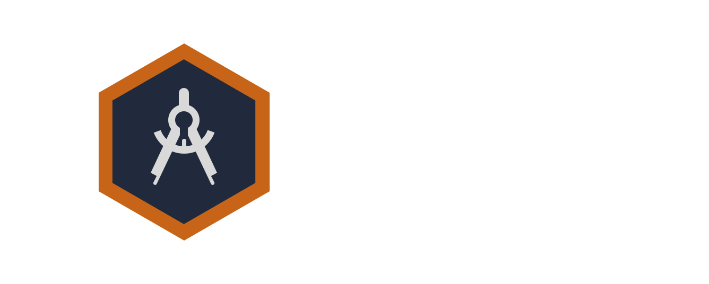

<a id="readme-top"></a>

<!-- PROJECT LOGO -->
<!--<br />-->
<div align="center">

</div>


<!-- PROJECT SHIELDS -->
<!--
*** I'm using markdown "reference style" links for readability.
*** Reference links are enclosed in brackets [ ] instead of parentheses ( ).
*** See the bottom of this document for the declaration of the reference variables
*** for contributors-url, forks-url, etc. This is an optional, concise syntax you may use.
*** https://www.markdownguide.org/basic-syntax/#reference-style-links
-->
[![WIN][Windows-shield]][Windows-url]
[![Last Commit][last-commit-shield]][last-commit-url]
[![Total Commits][total-commits-shield]][total-commits-url]
[![Apache 2.0 License][license-shield]][license-url]
[![C++][Cpp-shield]][Cpp-url]


<!-- Table of Contents -->
# :notebook_with_decorative_cover: Table of Contents

- [About the Project](#star2-about-the-project)
  <!--* [Screenshots](#camera-screenshots)
  * [Tech Stack](#space_invader-tech-stack)
  * [Environment Variables](#key-environment-variables)-->
- [Getting Started](#toolbox-getting-started)
  * [Prerequisites](#bangbang-prerequisites)
  <!-- * [Installation](#gear-installation)-->
  * [Create project files](#triangular_flag_on_post-create-project-files)
  * [Library Locally](#running-local-library)
  <!--- [Contributing](#wave-contributing)-->
- [License](#warning-license)

  

<!-- About the Project -->
## :star2: About the Project

Welcome to the Axle engine github page. This is just a small game engine that I'm creating in order to better understant how they work and how to program at a low level.

If you’re curious about the process or want to follow along with the ups and downs of building a game engine, check out the [blog series][blog-series].

<p align="right">(<a href="#readme-top">back to top</a>)</p>


<!-- Getting Started -->
## 	:toolbox: Getting Started

<!-- Prerequisites -->
### :bangbang: Prerequisites

This project uses **Premake** to generate the project files and is only compatible with windows (for now).

<p align="right">(<a href="#readme-top">back to top</a>)</p>


<!-- Installation -->
<!--### :gear: Installation-->


<!-- Create project files -->
### :triangular_flag_on_post: Create project files

To create the project files you simply need to cd into the folder

```
cd axle
```
And excecute the *premake5.exe* file in the vendor folder with the specific action (vs2022, gmake, ...).

```
.\vendor\premake\premake5.exe [action]
```

For more information check: [Using Premake](https://premake.github.io/docs/Using-Premake/)

<p align="right">(<a href="#readme-top">back to top</a>)</p>


<!-- Run Locally -->
### :running: Local Library

With the project files generated is as simple as opening your favourite editor and running or building the project.

<p align="right">(<a href="#readme-top">back to top</a>)</p>


<!-- Contributing -->
<!--## :wave: Contributing-->


<!-- License -->
## :warning: License

Axle is distributed under the [Apache License, Version 2.0][license-url].

<p align="right">(<a href="#readme-top">back to top</a>)</p>


<!-- MARKDOWN LINKS & IMAGES -->
<!-- https://www.markdownguide.org/basic-syntax/#reference-style-links -->
[license-shield]: https://img.shields.io/github/license/Estikno/axle.svg?style=for-the-badge
[license-url]: https://github.com/Estikno/axle/blob/main/LICENSE
[last-commit-shield]: https://img.shields.io/github/last-commit/Estikno/axle.svg?style=for-the-badge
[last-commit-url]: https://github.com/Estikno/axle/blob/main
[total-commits-shield]: https://img.shields.io/github/commit-activity/t/Estikno/axle.svg?style=for-the-badge
[total-commits-url]: https://github.com/Estikno/axle/commits/main/
[product-screenshot]: images/screenshot.png
[blog-series]: https://estikno.github.io/tags/game-engine
[Cpp-shield]: https://img.shields.io/badge/C++-0769AD?logo=C%2B%2B&logoColor=white&style=for-the-badge
[Cpp-url]: https://devdocs.io/cpp/
[Windows-shield]: https://custom-icon-badges.demolab.com/badge/Windows-0078D6?logo=windows11&logoColor=white&style=for-the-badge
[Windows-url]: https://www.microsoft.com/es-es/windows?r=1
