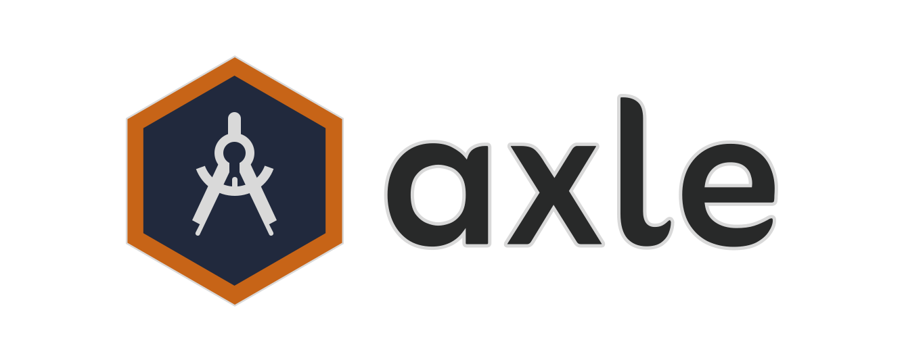

<a id="readme-top"></a>

<!-- PROJECT LOGO -->
<!--<br />-->


<!-- PROJECT SHIELDS -->
<!--
*** I'm using markdown "reference style" links for readability.
*** Reference links are enclosed in brackets [ ] instead of parentheses ( ).
*** See the bottom of this document for the declaration of the reference variables
*** for contributors-url, forks-url, etc. This is an optional, concise syntax you may use.
*** https://www.markdownguide.org/basic-syntax/#reference-style-links
-->
[![SDL2][SDL2-shield]][SDL2-url]
[![Last Commit][last-commit-shield]][last-commit-url]
[![Total Commits][total-commits-shield]][total-commits-url]
[![Apache 2.0 License][license-shield]][license-url]
[![Rust Language][rust-shield]][rust-url]


<!-- Table of Contents -->
# :notebook_with_decorative_cover: Table of Contents

- [About the Project](#star2-about-the-project)
  <!--* [Screenshots](#camera-screenshots)
  * [Tech Stack](#space_invader-tech-stack)
  * [Environment Variables](#key-environment-variables)-->
- [Getting Started](#toolbox-getting-started)
  * [Prerequisites](#bangbang-prerequisites)
  <!-- * [Installation](#gear-installation)-->
  * [Crates](#triangular_flag_on_post-crates)
  * [Library Locally](#running-local-library)
  <!--- [Contributing](#wave-contributing)-->
- [License](#warning-license)

  

<!-- About the Project -->
## :star2: About the Project

Welcome to my 2D game engine project! This is my deep dive into building a game engine from scratch using Rust. The goal here is to get hands-on with the core parts of a game engine—like rendering, input handling, and physics—while learning a ton along the way.

I’m using **SDL2** for the rendering side of things, and Rust for everything else because it’s fast, safe, and pretty awesome to work with. This project is all about experimenting and understanding how these systems work together.

If you’re curious about the process or want to follow along with the ups and downs of building a game engine, check out the [blog series][blog-series].

<p align="right">(<a href="#readme-top">back to top</a>)</p>


<!-- Getting Started -->
## 	:toolbox: Getting Started

<!-- Prerequisites -->
### :bangbang: Prerequisites

This project uses Rust and cargo to manage all the necessary libraries

You will also need to have the SDL2 libraries **(.lib files)** in your computer if you intend to run locally the project.
These libraries have to be placed into this path: **`C:\Users\USERNAME\.rustup\toolchains\stable-x86_64-pc-windows-msvc\lib\rustlib\x86_64-pc-windows-msvc\lib`**

<p align="right">(<a href="#readme-top">back to top</a>)</p>


<!-- Installation -->
<!--### :gear: Installation

To install the project simply clone this respository

```bash
  git clone https://github.com/Estiknok/KyodoBackend.git
  cd KyodoBackend
```

Now only excecute the following commands on a terminal inside the project to install the dependencies and setup the project

```bash
  npm i
  npm run build
```
-->

<!-- Crates library-->
### :triangular_flag_on_post: Crates

Currently, there is no published library on crates.io for this project, as we are in the process of adding documentation. However, it will be available soon. In the meantime, you can try out Axle locally. 

🙏I apologize for any inconvenience this may cause🙏

<p align="right">(<a href="#readme-top">back to top</a>)</p>


<!-- Run Locally -->
### :running: Local Library

If you want the newest additions to the library, simply clone the repository and in your `cargo.toml` add the dependency by path instead of by name, which uses crates.io

Example of a `cargo.toml` file with the Axle dependency added by path
```
[package]
name = "example"
version = "0.1.0"
edition = "2021"

[dependencies]
axle = { path = "path/to/axle" }
```

<p align="right">(<a href="#readme-top">back to top</a>)</p>


<!-- Contributing -->
<!--## :wave: Contributing

<a href="https://github.com/Estiknok/KyodoBackend/graphs/contributors">
  
</a>


Contributions are always welcome!-->

<!-- License -->
## :warning: License

Axle is distributed under the [Apache License, Version 2.0][license-url].

<p align="right">(<a href="#readme-top">back to top</a>)</p>


<!-- MARKDOWN LINKS & IMAGES -->
<!-- https://www.markdownguide.org/basic-syntax/#reference-style-links -->
[license-shield]: https://img.shields.io/github/license/Estikno/axle.svg?style=for-the-badge
[license-url]: https://github.com/Estikno/axle/blob/main/LICENSE
[last-commit-shield]: https://img.shields.io/github/last-commit/Estikno/axle.svg?style=for-the-badge
[last-commit-url]: https://github.com/Estikno/axle/blob/main
[total-commits-shield]: https://img.shields.io/github/commit-activity/t/Estikno/axle.svg?style=for-the-badge
[total-commits-url]: https://github.com/Estikno/axle/commits/main/
[product-screenshot]: images/screenshot.png
[blog-series]: https://estikno.github.io/tags/game-engine
[Rust-shield]: https://img.shields.io/badge/Rust-000000?style=for-the-badge&logo=rust&logoColor=white
[Rust-url]: https://www.rust-lang.org/
[SDL2-shield]: https://img.shields.io/badge/SDL2-0769AD?style=for-the-badge&logo=SDL&logoColor=white
[SDL2-url]: https://www.libsdl.org/
